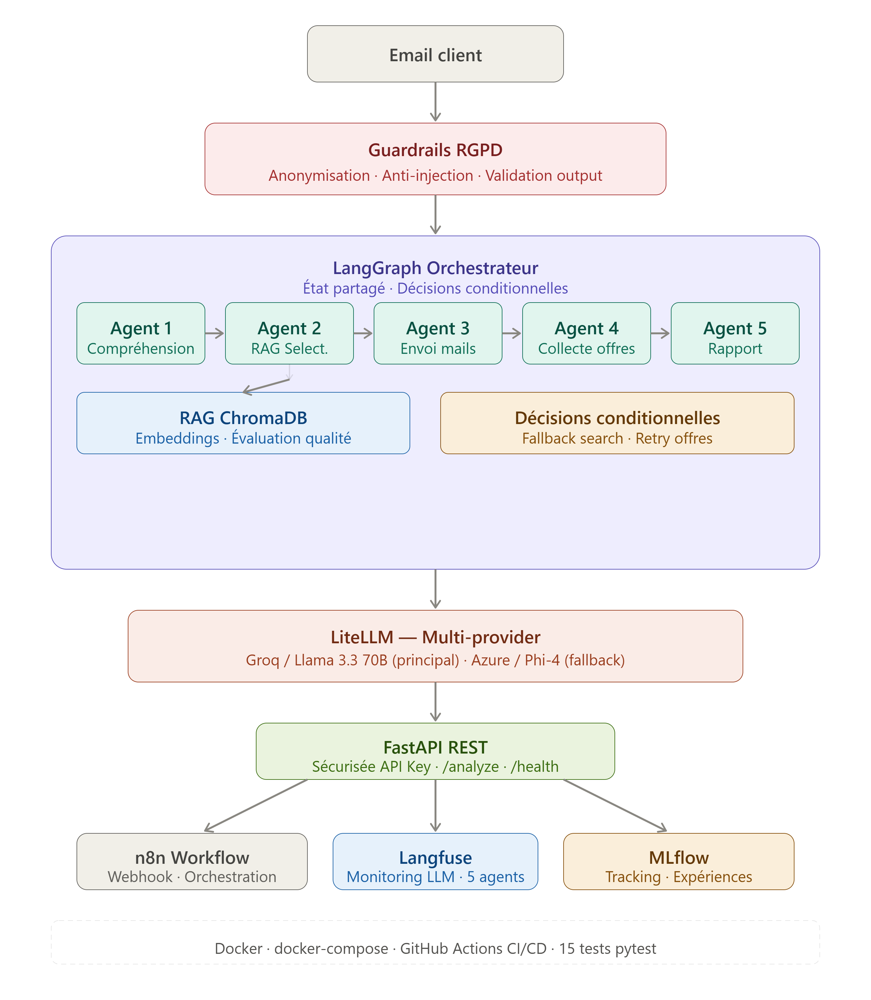
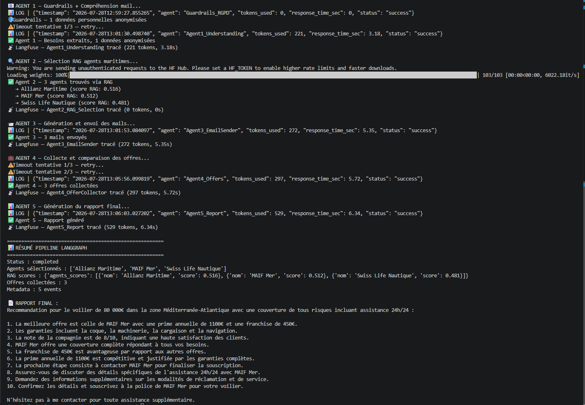
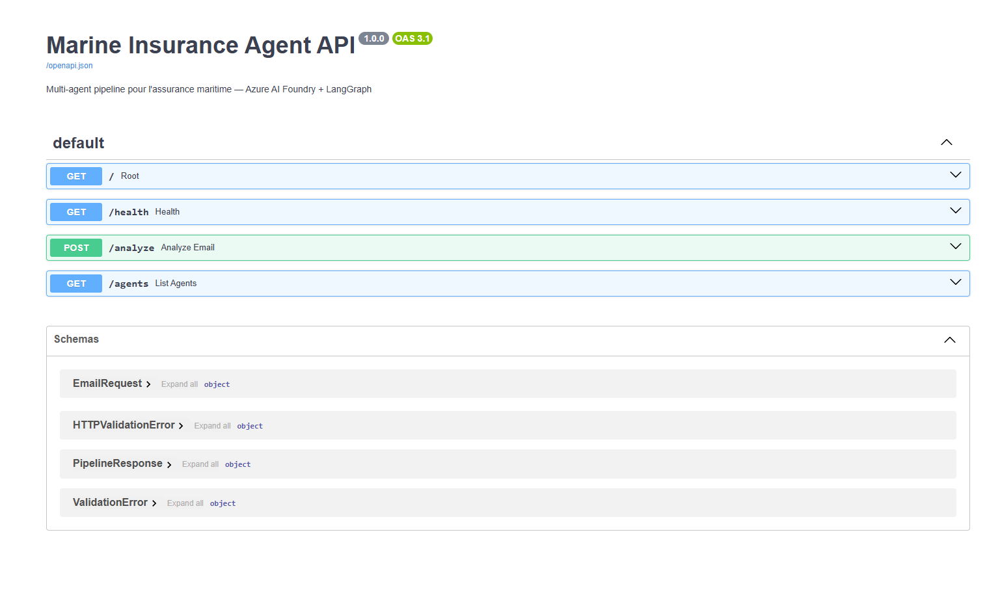
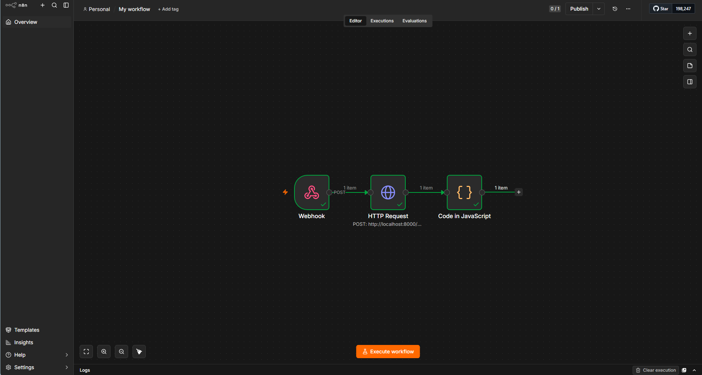
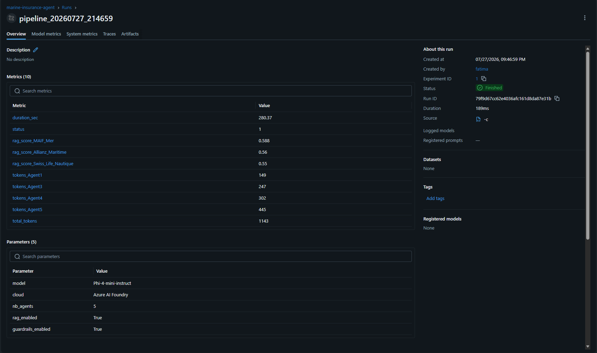
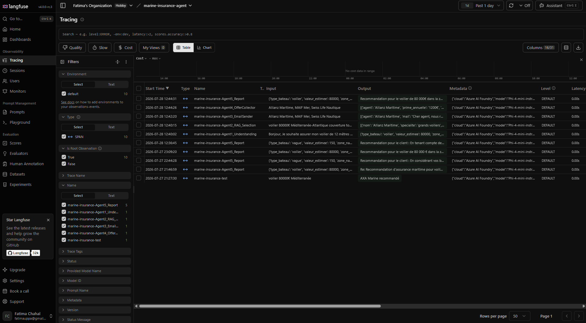

# 🚢 Marine Insurance Agent — Multi-Agent POC

Pipeline multi-agents IA pour l'assurance maritime, construit sur **Microsoft Azure AI Foundry**, **Groq/Llama 3.3** et **LangGraph**.

> **Cas d'usage réel** : Automatisation du processus de sélection d'assurance maritime — de la réception du mail client jusqu'au rapport de recommandation final, en moins de 20 secondes.

---

## 🏗️ Architecture

Email client
↓
Guardrails RGPD (anonymisation + injection check + output validation)
↓
LangGraph Orchestrateur (décisions conditionnelles)
├── Agent 1 : Compréhension mail
├── Agent 2 : Sélection RAG → ChromaDB
│ ↓ si < 2 agents → Fallback Search
├── Agent 3 : Génération mails agents maritimes
├── Agent 4 : Collecte et comparaison offres
│ ↓ si < 2 offres → Retry Agent 3
└── Agent 5 : Rapport final + recommandation
↓
LiteLLM (Groq/Llama 3.3 principal → Azure/Phi-4 fallback)
↓
FastAPI REST API (sécurisée API Key)
↓
n8n (orchestration workflow visuel)
↓
Langfuse (monitoring LLM) + MLflow (tracking expériences)


---

## 🛠️ Stack technique

| Composant | Technologie |
|-----------|-------------|
| Cloud | Microsoft Azure AI Foundry |
| LLM Principal | Groq / Llama 3.3 70B |
| LLM Fallback | Azure / Phi-4-mini-instruct |
| Multi-LLM | LiteLLM (fallback automatique) |
| Orchestration agents | LangGraph (décisions conditionnelles) |
| RAG | ChromaDB + all-MiniLM-L6-v2 |
| Évaluation RAG | Faithfulness · Relevancy · Context Precision |
| Monitoring LLM | Langfuse (5 agents tracés) |
| Tracking MLOps | MLflow |
| Gouvernance RGPD | Guardrails custom (anonymisation + injection + output) |
| API | FastAPI (sécurisée API Key) |
| Workflow | n8n |
| Containerisation | Docker + docker-compose |
| CI/CD | GitHub Actions |
| Tests | pytest (15 tests) |
| A2A Protocol | Google A2A Standard (agent discovery + inter-agent HTTP) |

---

## ⚡ Performance

| Métrique | Valeur |
|----------|--------|
| Durée pipeline complète | ~20 secondes |
| Tokens moyens par run | ~2000 tokens |
| Agents LangGraph | 5 agents spécialisés |
| Tests unitaires | 15/15 ✅ |
| RAG scores | 0.48 - 0.52 |

---

## 📸 Screenshots

### Architecture complète


### Pipeline en action


### FastAPI — Documentation Swagger


### n8n — Workflow visuel


### MLflow — Tracking des expériences


### Langfuse — Monitoring LLM


---

## 📁 Structure du projet

marine-insurance-agent/
├── agents/ # 5 agents spécialisés
│ ├── agent1_understanding.py
│ ├── agent2_selection.py
│ ├── agent3_email_sender.py
│ ├── agent4_offer_collector.py
│ └── agent5_report.py
├── graph/ # LangGraph orchestration
│ ├── pipeline.py # Pipeline + décisions conditionnelles
│ ├── state.py # État partagé entre agents
│ └── guardrails.py # RGPD + sécurité + anti-injection
├── rag/ # RAG pipeline
│ ├── vectorstore.py # ChromaDB + embeddings
│ ├── data.py # Base agents maritimes
│ └── evaluation.py # Évaluation qualité RAG
├── monitoring/ # MLOps
│ ├── langfuse_config.py # Monitoring LLM traces
│ └── mlflow_config.py # Tracking expériences
├── utils/ # Utilitaires
│ ├── azure_client.py # Client LLM centralisé
│ ├── litellm_client.py # Multi-LLM + fallback automatique
│ └── logger.py # Logs structurés
├── mcp_tools/ # MCP Gmail + Drive (architecture prête)
│ └── gmail_tool.py
├── tests/ # Tests unitaires pytest
│ ├── test_guardrails.py # 6 tests
│ ├── test_rag.py # 5 tests
│ └── test_api.py # 4 tests
├── n8n_workflows/ # Workflow n8n exporté
│ └── marine-insurance-pipeline.json
├── screenshots/ # Captures d'écran
├── .github/workflows/ # CI/CD GitHub Actions
│ └── ci.yml
├── api.py # FastAPI REST API
├── Dockerfile
├── docker-compose.yml
└── requirements.txt


---

## 🚀 Installation

### Option 1 — Local

```bash
git clone https://github.com/FatimaChahal/marine-insurance-agent
cd marine-insurance-agent
python3 -m venv venv
source venv/bin/activate
pip install -r requirements.txt
cp .env.example .env
# Configure tes clés dans .env
uvicorn api:app --reload --port 8000
```

### Option 2 — Docker

```bash
git clone https://github.com/FatimaChahal/marine-insurance-agent
cd marine-insurance-agent
cp .env.example .env
# Configure tes clés dans .env
docker-compose up -d
```

---

## ⚙️ Configuration

```bash
# Azure AI Foundry
AZURE_ENDPOINT=https://your-resource.services.ai.azure.com/openai/v1
AZURE_API_KEY=your_azure_api_key

# Groq (LLM principal)
GROQ_API_KEY=your_groq_api_key

# Langfuse Monitoring
LANGFUSE_PUBLIC_KEY=pk-lf-xxx
LANGFUSE_SECRET_KEY=sk-lf-xxx
LANGFUSE_HOST=https://cloud.langfuse.com

# API Security
API_KEY=your-secret-api-key

# Anthropic (MCP — optionnel)
ANTHROPIC_API_KEY=your_anthropic_key
```

---

## 📡 API Endpoints

| Method | Endpoint | Auth | Description |
|--------|----------|------|-------------|
| GET | `/` | Non | Infos service + stack |
| GET | `/health` | Non | Health check |
| POST | `/analyze` | ✅ API Key | Analyse mail client → rapport |
| GET | `/agents` | Non | Liste agents maritimes disponibles |

### Exemple

```bash
curl -X POST "http://localhost:8000/analyze" \
  -H "Content-Type: application/json" \
  -H "X-API-Key: your-secret-api-key" \
  -d '{
    "email_content": "Bonjour, je veux assurer mon voilier 80000€ Méditerranée. Merci, Jean Dupont",
    "client_id": "client_001"
  }'
```

---

## 🤖 Architecture agentique LangGraph

Le pipeline utilise des **décisions conditionnelles** pour une vraie intelligence agentique :

Agent 2 → si score RAG < seuil → Fallback Search élargie
Agent 4 → si < 2 offres reçues → Retry Agent 3 automatique


---

## 🛡️ Gouvernance & Conformité RGPD

- **Anonymisation automatique** des données personnelles avant envoi au LLM
- **Détection de prompt injection** sur chaque requête entrante
- **Validation des outputs** LLM pour éviter la fuite de données
- **Traçabilité complète** via Langfuse (qui a fait quoi, quand)
- **Audit trail** MLflow sur chaque run du pipeline
- **API sécurisée** par API Key

---

## 🔄 Multi-LLM avec LiteLLM

```python
# Groq principal (rapide, ~1s par agent)
# Azure fallback automatique si Groq indisponible
# Extensible : OpenAI, Mistral, Anthropic...
```

---

## 🧪 Tests

```bash
# Lancer tous les tests
python3 -m pytest tests/ -v

# Résultat attendu : 15/15 tests passés
```

---

## 👩‍💻 Auteur

**Fatima Chahal** — AI Engineer | MLOps | Privacy by Design

- 🎓 Doctorat Systèmes Distribués (UTT)
- 🔬 Postdoc IA générative (UPPA — Projet EU AI4MultiGIS)
- 🔗 [GitHub](https://github.com/FatimaChahal)
- 📚 [Google Scholar](https://scholar.google.com/citations?user=I106NZcAAAAJ&hl=fr)# CI/CD test
